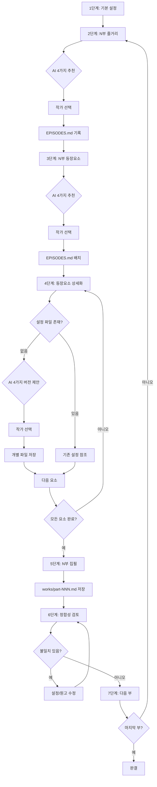

# 웹소설 집필 워크플로우 플로우차트

## 다이어그램

---

## 단계별 상세 설명

### 1단계: 기본 설정

- **TEMPLATE.md**에 장르, 시놉시스, 부작 구성 작성
- 예: "판타지, 회귀물, 총 200부작"

### 2단계: N부 줄거리

- **AI가 추천하는 4가지**: 해당 부의 핵심 줄거리 4개 버전
- 예: "1부에서 주인공이 각성하는 과정" 4가지 시나리오
- **제안 저장**: `proposals/plot-NNN-options.md`
- **선택 기록**: `EPISODES.md` → N부 줄거리 섹션

### 3단계: N부 등장요소

- **AI가 추천하는 4가지**: 해당 부에 등장할 캐릭터/사물/현상 조합
- 예: "주인공, 히로인, 멘토, 전설의 검" 등 4가지 조합
- **제안 저장**: `proposals/elements-NNN-options.md`
- **선택 기록**: `EPISODES.md` → N부 등장요소 표

### 4단계: 등장요소 상세화

- **파일명 규칙**: 소문자 ASCII + 하이픈, 공백/언더스코어 금지, 중복 시 접미사(-2)
- **설정 파일 위치**:
  - 캐릭터: `characters/han-seo-jun.md` (표시명: 한서준)
  - 사물: `objects/ashen-sword.md` (표시명: 재의 검)
  - 현상: `phenomena/mana-overflow.md` (표시명: 마나폭주)
- **AI가 제안하는 4가지 버전**: 해당 요소의 상세 설정 4개 버전
  - 예: 주인공의 성격, 외모, 말투, 배경 등을 4가지 다른 스타일로 제안
- 작가가 선택하면 해당 폴더에 개별 파일로 저장

### 5단계: N부 집필

- 모든 등장요소 설정이 완료되면 AI가 원고 작성
- **저장 위치**: `works/part-NNN.md`

### 6단계: 정합성 검토

- 집필된 원고와 설정 파일 간 불일치 확인
- 불일치 발견 시 **설정이 원칙, 원고가 예외** (설정 수정보다 원고 수정 우선)

**체크리스트:**

- [ ] 말투: 캐릭터별 말투가 설정과 일치하는가?
- [ ] 관계: 인물 간 관계 묘사가 설정과 일치하는가?
- [ ] 능력: 캐릭터/사물/현상의 능력이 설정대로 묘사되었는가?
- [ ] 시간선: 사건 순서가 논리적으로 맞는가?
- [ ] 지명/용어: 고유명사가 일관되게 사용되었는가?
- [ ] 시점: 서술 시점(1인칭/3인칭)이 일관적인가?

### 7단계: 다음 부 진행

- 마지막 부가 아니면 2단계로 돌아가 N+1부 진행
- 마지막 부 완료 시 작품 완결
