# 웹소설 집필 워크플로우 플로우차트

> **루트 경로**: `.vibe-coding/WEBNOVEL/` (모든 상대 경로는 이 위치 기준)

## 다이어그램

```mermaid
flowchart TD
    A["1단계: 작품 기본 설정<br>TEMPLATE.md 작성"] --> B["2단계: N화 전개안/줄거리 확정"]
    B --> C{"AI가 전개안 4개 제안<br>각 안: 목표/갈등/핵심사건/클리프행어"}
    C --> C1["제안 저장<br>proposals/plot-NNNN-options.md"]
    C1 --> D["작가 1안 선택 + 선택 이유 메모"]
    D --> E["EPISODES.md에 N화 줄거리 반영"]
    
    E --> F["3단계: N화 등장요소(캐릭터/사물/현상) 확정"]
    F --> G{"AI가 등장요소 조합 4세트 제안<br>각 세트: 역할/등장장면 힌트 포함"}
    G --> G1["제안 저장<br>proposals/elements-NNNN-options.md"]
    G1 --> H["작가 1세트 선택 + 선택 이유 메모"]
    H --> I["EPISODES.md에 등장요소 표 반영"]

    I --> HK["3.5단계: N화 복선/떡밥 계획"]
    HK --> HK0{"AI가 훅 계획 4세트 제안<br>각 세트: 신규 심기/기존 강화/회수 포함"}
    HK0 --> HK1["제안 저장<br>proposals/hooks-NNNN-options.md"]
    HK1 --> HK2["작가 1세트 선택 + 선택 이유 메모"]
    HK2 --> HK3["EPISODES.md에 훅 표 반영<br>hooks/ 파일 생성·갱신"]

    HK3 --> LK["3.6단계: 미해결 과제 관리"]
    LK --> LK0{"AI가 루프(미해결 과제) 4세트 제안<br>각 세트: 신규 열기/진행/해결 포함"}
    LK0 --> LK1["제안 저장<br>proposals/loops-NNNN-options.md"]
    LK1 --> LK2["작가 1세트 선택 + 선택 이유 메모"]
    LK2 --> LK3["EPISODES.md에 루프 표 반영<br>loops/ 파일 생성·갱신"]

    LK3 --> J["4단계: 신규/변경 요소 상세화"]
    J --> K{"설정 파일 존재?"}
    K -->|없음| L{"AI가 상세 설정 4버전 제안<br>외형/성격·효과/능력/제약/관계/키워드"}
    L --> L1["제안 저장<br>proposals/character-슬러그-options.md 등"]
    L1 --> M["작가 1버전 선택"]
    M --> N["개별 파일 저장<br>characters/영문-슬러그.md 등"]
    K -->|있음| O["기존 설정 참조(변경점만 메모)"]
    N --> P["다음 요소"]
    O --> P
    P --> J2{"모든 요소 완료?"}
    J2 -->|아니오| J
    J2 -->|예| Q0{"초고 draft.txt 있음?"}
    Q0 -->|예| Q1["draft.txt 입력(작가 초고)"]
    Q0 -->|아니오| Q2["AI가 원고 초안 작성"]
    Q1 --> QM{"작성 방식 선택"}
    Q2 --> QM
    QM -->|일괄| QA["AI가 전체 원고 작성<br>규격: TEMPLATE.md"]
    QM -->|3분할| QB["AI가 1/3 작성"]
    QB --> QC{"작가 검토/승인?"}
    QC -->|예| QD["AI가 2/3 작성"]
    QC -->|수정 요청| QB
    QD --> QE{"작가 검토/승인?"}
    QE -->|예| QF["AI가 3/3 작성"]
    QE -->|수정 요청| QD
    
    QF --> PD{"4.5단계: 웹소설 PD 검토<br>도파민/가독성/절단신공 체크"}
    QA --> PD
    PD --> PD_FIX{"불합격?"}
    PD_FIX -->|예| QM
    PD_FIX -->|아니오| Q["5단계: N화 원고 확정"]
    
    Q --> R["works/episode-NNNN.md 저장"]
    
    R --> R2["6단계: 이미지 프롬프트 삽입<br>img 블록 추가"]
    R2 --> S["7단계: 정합성 검토<br>설정 파일 <-> 원고"]
    S --> T{"불일치 있음?"}
    T -->|예| U["설정/원고 수정(원칙: 설정 우선)"]
    U --> S
    T -->|아니오| V["8단계: 다음 화로"]
    
    V --> W{"마지막 화?"}
    W -->|아니오| Y{"N이 5의 배수?"}
    Y -->|예| Z["마일스톤 점검<br>지난 5화 아크/목표 확인"]
    Z --> B
    Y -->|아니오| B
    W -->|예| X["완결"]
```



---

## 단계별 상세 설명

### 1단계: 기본 설정

- **TEMPLATE.md**에 장르, 시놉시스, 연재 계획 작성
- 예: "판타지, 회귀물, 총 200화 예상"

### 2단계: N화 전개안(줄거리)

- **AI가 추천하는 4가지(전개안 4개)**: 서로 다른 방향의 N화 전개안 4개
  - 각 전개안에 최소 포함: 이번 화 **목표**, **핵심 갈등/장애물**, **주요 사건(3~5개)**, **전환점**, **클리프행어(다음 화 떡밥)**
  - 전개안끼리는 결과/톤/갈등축이 겹치지 않도록 차별화
  - 예: "1화에서 주인공이 각성하는 과정"을 4가지 다른 전개로 제안
- **제안 저장**: `proposals/plot-NNNN-options.md`
- **선택 기록**: `EPISODES.md` → N화 줄거리 섹션

### 3단계: N화 등장요소

- **AI가 추천하는 4가지(조합 4세트)**: N화에 등장할 **캐릭터/사물/현상** 후보를 4세트로 제안
  - 각 세트에 최소 포함: 요소 목록 + 각 요소의 **역할(갈등/해결/단서 등)**, **등장 장면 힌트(언제/어디서/왜)**
  - 예: "주인공/히로인/멘토/전설의 검" 같은 구성을 4가지 다른 조합으로 제안
- **제안 저장**: `proposals/elements-NNNN-options.md`
- **선택 기록**: `EPISODES.md` → N화 등장요소 표

### 3.5단계: N화 복선/떡밥(Hooks)

- **AI가 추천하는 4가지(훅 계획 4세트)**: N화에서 다룰 훅을 4세트로 제안
  - 각 세트에 최소 포함: 신규 훅(심기) 0~2개, 기존 훅(강화) 0~2개, 기존 훅(회수) 0~1개
  - 각 훅마다 최소 포함: 독자에게 보이는 단서(장면/대사), 작가 의도(의미), 회수 방향(미정 가능)
- **제안 저장**: `proposals/hooks-NNNN-options.md`
- **선택 기록**: `EPISODES.md` → N화 복선/떡밥 표
- **훅 파일 관리**: `hooks/영문-슬러그.md` (예: `hooks/mysterious-scar.md`)

### 3.6단계: N화 미해결 과제(Open Loops)

- **AI가 추천하는 4가지(루프 세트 4개)**: N화에서 관리할 “미해결 과제”를 4세트로 제안
  - 각 세트에 최소 포함: 신규 루프(열기) 0~2개, 기존 루프(진행) 0~3개, 기존 루프(해결) 0~1개
  - 각 루프마다 최소 포함: 현재 미해결 상태(무엇이 남았는지), 다음 진행 조건(무엇이 필요/위험한지), 해결 정의(무엇이면 닫히나)
- **제안 저장**: `proposals/loops-NNNN-options.md`
- **선택 기록**: `EPISODES.md` → N화 미해결 과제 표
- **루프 파일 관리**: `loops/영문-슬러그.md` (예: `loops/pay-the-debt.md`)

### 4단계: 신규/변경 요소 상세화

> **핵심 원칙**: 해당 화에서 **신규/변경**되는 요소만 상세화합니다. 기존 요소는 참조만 합니다.

- **파일명 규칙**: 소문자 ASCII + 하이픈, 공백/언더스코어 금지, 중복 시 접미사(-2)
- **설정 파일 위치**:
  - 캐릭터: `characters/han-seo-jun.md` (표시명: 한서준)
  - 사물: `objects/ashen-sword.md` (표시명: 재의 검)
  - 현상: `phenomena/mana-overflow.md` (표시명: 마나폭주)
- **AI가 제안하는 4가지 버전**: 해당 요소의 상세 설정을 4가지 다른 버전으로 제안
  - 캐릭터 예: **외모/성격(핵심 특성 3가지)/말투/배경/관계** 중심으로 4버전
  - 사물 예: **외형/능력·효과/제약/유래/소유자** 중심으로 4버전
  - 현상 예: **발동조건/효과/지속시간/부작용·제한** 중심으로 4버전
- 작가가 선택하면 해당 폴더에 개별 파일로 저장

### 4.5단계: 웹소설 PD 검토

원고 확정 전, **웹소설 PD/편집자**의 시선으로 결과물을 검증합니다.

**검토 기준:**

1. **가독성**: 모바일 최적화(짧은 문장, 넉넉한 여백)가 되어 있는가?
2. **도파민/사이다**: 독자에게 확실한 보상이나 감정적 고양을 주는가?
3. **절단신공**: 다음 화를 안 보고는 못 배기게 끊었는가?
4. **연재 감각**: 떡밥 심기나 회수가 자연스러운가?

**출력 형식:**

- `[요약]`, `[🎯 감정 타겟]`, `[📌 키워드]`, `[💡 편집자 코멘트]`, `[🔥 다음 화 힌트]` 포함

### 5단계: N화 원고 확정(집필)

**웹소설 집필 문법 준수:**

- **3줄 훅 규칙**: 모든 장면 시작 3줄 안에 반전, 강렬한 묘사, 위기 상황 중 하나를 반드시 포함.
- **1-3-1 회차 구조**: 1개 사건 -> 3단계 전개(시도-좌절-변화) -> 1개 강력한 클리프행어.
- **Show, Don't Tell**: "화가 났다" 대신 신체 반응과 대사로 묘사.
- **킬라인(Kill-line)**: 사이다 장면에선 독자의 스트레스를 터뜨리는 명대사 한 줄을 만듦.

**초고 확인:**

1. 작가가 미리 준비한 초고가 있는가?
   - **있음**: `draft.txt`에 저장 → AI가 참조하여 원고 작성 (사용 후 내용 삭제)
   - **없음**: AI가 처음부터 원고 작성

**작성 방식 선택:**

- **일괄 작성**: AI가 원고 규격에 맞춰 전체 원고를 한 번에 작성
- **3분할 작성**: 원고를 1/3씩 나눠서 작성 → 각 분할마다 검토/승인 후 다음 분할 진행
  - 장점: 방향 수정이 용이, 피드백 반영 가능
  - 단점: 시간 소요 증가

- **원고 규격**: TEMPLATE.md의 `## 원고 규격` 섹션 참조 (글자수, 시점, 문체 등)
- **저장 위치**: `works/episode-NNNN.md`

### 6단계: 이미지 프롬프트 삽입

원고 검토 후, AI 이미지 생성이 필요한 위치에 프롬프트를 삽입합니다.

**마커 형식:**

```markdown
:::img
장면 설명, 분위기, 스타일, 색감, 구도 등 상세 프롬프트
:::
```

> **파싱 규칙**: `:::img`로 시작해서 `:::`로 끝나는 블록은 웹 렌더링 시 제외됩니다.

**AI 이미지 생성용 프롬프트 작성 가이드:**

- **장면**: 누가, 어디서, 무엇을 하는지
- **분위기**: 로맨틱, 긴장, 우울, 활기 등
- **스타일**: 웹툰, 수채화, 유화, 애니메이션 등 (TEMPLATE.md 참조)
- **색감**: 밝은/어두운, 따뜻한/차가운, 채도 등
- **구도**: 클로즈업, 전신, 조감도, 인물 중심 등

### 7단계: 정합성 검토

- 집필된 원고와 설정 파일 간 불일치 확인
- 불일치 발견 시 **설정이 원칙, 원고가 예외** (설정 수정보다 원고 수정 우선)

**체크리스트:**

- 말투: 캐릭터별 말투가 설정과 일치하는가?
- 관계: 인물 간 관계 묘사가 설정과 일치하는가?
- 능력: 캐릭터/사물/현상의 능력이 설정대로 묘사되었는가?
- 시간선: 사건 순서가 논리적으로 맞는가?
- 지명/용어: 고유명사가 일관되게 사용되었는가?
**웹소설 자가 점검 (Self-Check):**
- 첫 3줄에 "어?" 하는 포인트가 있는가?
- 이번 회차에서 플롯/관계/세계관 중 최소 1개가 확실히 움직였는가?
- 마지막 문단이 다음 화를 누르게 만드는가?
- 캐릭터가 정보 전달용 인형이 아니라 살아 움직이는가?
- 불필요한 설명으로 늘어지는 부분이 없는가?

- 시점: 서술 시점(1인칭/3인칭)이 일관적인가?

**설정 역반영(Backporting):**

원고가 기존 설정보다 더 나은 방향으로 발전했다면, 예외적으로 설정 파일을 업데이트합니다:

1. 변경이 필요한 설정 파일(`characters/*.md` 등)을 식별
2. 변경 사유와 이전 값을 주석으로 기록
3. 새로운 설정으로 업데이트

### 8단계: 다음 화 진행

- 마지막 화가 아니면 2단계로 돌아가 N+1화 진행
- 마지막 화 완료 시 작품 완결

**마일스톤 점검 (5화 단위):**

5화, 10화, 15화... 등 5화 단위 도달 시, 다음 화 진행 전에 스토리 아크를 점검합니다:

- 지난 5화 동안의 전개가 전체 플롯에 부합하는가?
- 주요 인물의 성장/변화가 적절한 속도로 진행되고 있는가?
- 독자가 지루함을 느낄 만한 구간이 있었는가?
- 다음 5화의 핵심 목표와 클라이막스는 무엇인가?
